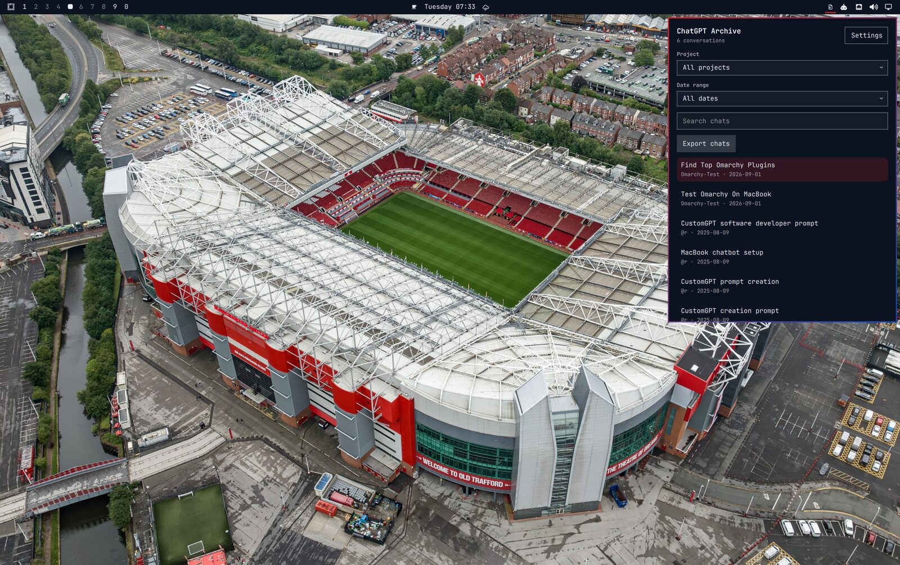
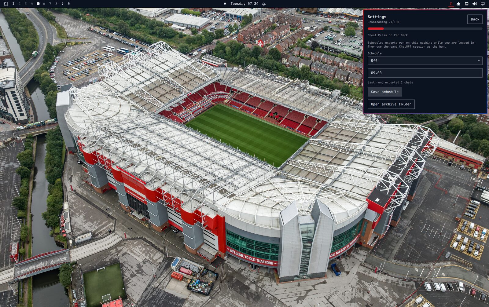
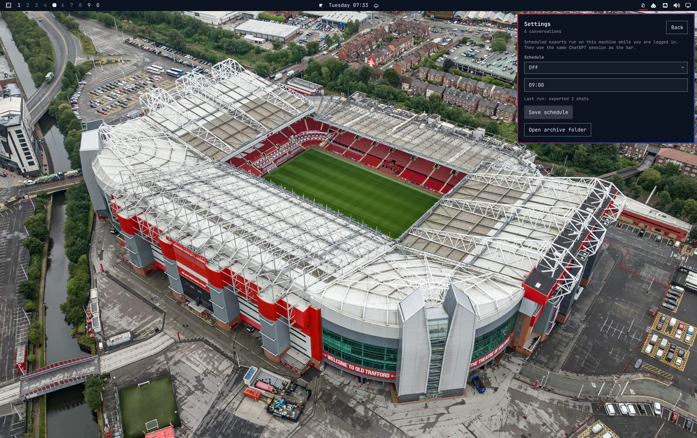

# ChatGPT Archive

Keep your ChatGPT history on your Omarchy machine. A zip icon on the bar opens a panel beside it — the same pattern as clock and audio. Log in through the browser, pick a project and date range, and export conversations to local Markdown you can open in your editor.

Live shots from this desktop, including chats from the **Omarchy-Test** project.








## What it does

ChatGPT’s official export is a slow ZIP. This plugin is the other way: a native Omarchy panel that talks to your signed-in ChatGPT session, downloads matching threads, and writes them as `.md` files under `~/.local/share/chatgpt-archive`.

It is the Omarchy front end for work that started in [chatgpt-download-engine](https://github.com/anujraja/chatgpt-download-engine) — a CLI, Python package, and TypeScript archive runtime for private ChatGPT backups. That engine is how conversations, projects, and incremental updates were proven. This repo is the public plugin: bar widget, browser login, progress, and schedules, with no extra packages beyond Omarchy.

## Features

- **Bar panel** — compact zip icon on the right; click opens a popup under the button
- **Browser login** — **Log in to ChatGPT** opens a window; the session is picked up in the background (no token paste)
- **Project and date filters** — all projects or one (for example Omarchy-Test); last 7 / 30 / 90 days or all dates
- **Search** — filter the local list by title
- **Export with progress** — listing and download shown on a bar, including the current chat title
- **Incremental** — skip conversations that have not changed since the last archive
- **Open in editor** — click a `.md` row to open it with `omarchy launch editor`
- **Folder** — on the home panel and in Settings; opens the archive directory
- **Official ZIP import** — still works if you use ChatGPT → Settings → Data controls → Export data
- **Schedule** — Off / Daily / Weekly via a systemd user timer on this machine

## Install

```bash
omarchy plugin add https://github.com/anujraja/omarchy-chatgpt-archive.git --enable
```

If the icon is missing from the bar:

```bash
omarchy plugin enable io.github.anujraja.chatgpt-archive right
omarchy restart shell
```

Update later:

```bash
omarchy plugin update io.github.anujraja.chatgpt-archive
omarchy restart shell
```

## Use

| Input | Action |
| --- | --- |
| Left click the icon | Open the panel |
| Middle click | Start an export |
| Right click | Open the archive folder |
| Click a `.md` row | Open that chat in the Omarchy editor |
| **Folder** | Open `~/.local/share/chatgpt-archive` |
| **Settings** | Schedule and last-run status |

First time: **Log in to ChatGPT**, sign in in the browser, wait until the panel says you are signed in. Then choose a project and range and **Export**.

## Settings

Panel → **Settings**:

- Repeat: Off, Daily, or Weekly
- Time (`HH:MM`), plus weekday for weekly
- **Save schedule** writes `chatgpt-archive.timer` (systemd --user)
- **Folder** opens the archive

Scheduled runs use the same local session as the bar and fire while you are logged in.

## Remove

```bash
omarchy plugin remove io.github.anujraja.chatgpt-archive
```

That leaves the archive, session file, and timer in place. To drop the timer:

```bash
systemctl --user disable --now chatgpt-archive.timer
```

## Privacy

- Session lives only in `~/.config/chatgpt-archive/config.env` (mode `600`)
- Never passed as a command-line flag
- Python 3 from Omarchy; no extra packages
- Plugins run unsandboxed, like every Omarchy plugin

## Marketplace

| | |
| --- | --- |
| Id | `io.github.anujraja.chatgpt-archive` |
| Kind | `bar-widget` |
| License | MIT |
| Category | Productivity |
| Tags | `bar`, `quickshell` |

List it from [plugins.omarchy.org/publish.html](https://plugins.omarchy.org/publish.html).

## License

MIT. ChatGPT conversation files remain your data. The download engine this plugin grew from is [chatgpt-download-engine](https://github.com/anujraja/chatgpt-download-engine).
